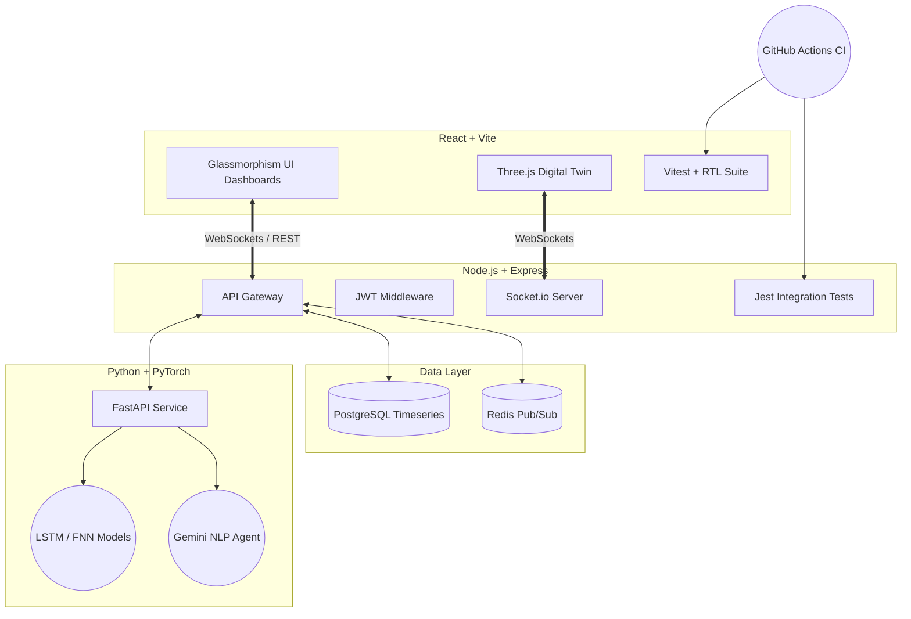

# 🏭 SmartFactory-Nexus (IIoT Digital Twin Platform)


An Enterprise-Grade **Industrial IoT (IIoT) Platform** engineered by **Siva Ganesh**. 
Featuring a WebGL 3D Digital Twin, Real-Time WebSockets Telemetry, Time-Series Analytics, PyTorch Deep Learning backend for Predictive Maintenance, and a strict Automated CI/CD Testing Pipeline.

---

## 🌟 Core Enterprise Features

*   **🌐 3D Digital Twin (WebGL):** Real-time 3D visualization of a massive 2-acre factory campus using `Three.js` and `React Three Fiber`. 
    *   **Live 3D Machinery**: CNC machines physically react to their backend IoT status (animated spindles when "Running", warning lights when "Offline").
    *   **AI Anomaly Heatmaps**: Real-time rendering of glowing hazard zones and dynamic lighting shifts when the AI detects bottlenecks or thermal risks.
    *   **Holographic Overlays**: Dynamic HTML labels floating in 3D space tracking live Machine IDs and statuses.
    *   **Cinematic CAD Controls**: Seamless navigation across the massive campus using traditional CAD-style `OrbitControls` (Left-click orbit, Right-click pan) and Drone fly-through modes.
*   **⚡ Real-Time Data Streaming (Redis Pub/Sub):** Bi-directional WebSockets (`Socket.io`) backed by a Redis Message Broker, streaming live machine telemetry directly to the dashboard, eliminating REST polling.
*   **📈 Time-Series Historical Analytics:** Automated ingestion pipeline from Redis to PostgreSQL `telemetry_history` tables. Visualized on the frontend via interactive `Recharts` glassmorphism modals.
*   **📦 Dynamic Supply Chain ERP:** IoT Edge Simulator executes live SQL decrements against the `inventory` table based on production output.
*   **🧠 Deep Learning Predictive Maintenance:** A PyTorch Feed-Forward Neural Network trained to predict point-in-time machine failure probabilities based on sensor data.
*   **🔮 Time-Series AI Forecasting:** A PyTorch LSTM Neural Network simulating advanced forecasting of future thermodynamic trajectories, visualized via dual-line graphs in React.
*   **🤖 LLM Factory Assistant:** Integrated Natural Language Processing chatbot (Gemini 2.5) capable of analyzing factory output and providing strategic insights.

### 🏢 Next-Generation Dashboards (Glassmorphism & High-Density UI)
*   **Executive Command Center:** A data-dense dashboard featuring a 6-metric KPI grid (OEE, Revenue at Risk, AI Energy Savings), live-animated dual-axis `ComposedCharts`, and an interactive **AI Prescriptive Action Center**.
*   **MLOps Control Center:** A dedicated dashboard for managing Neural Network health. Features area charts for visualizing loss vs. accuracy convergence, live inference latency telemetry, and a trigger for remote PyTorch retraining loops.
*   **Compliance Audit Ledger:** Immutable database ledger tracking all administrative actions with an integrated live search, role-distribution charts, and cryptographic hash simulations.

### 🚀 Enterprise DevOps & Automated Testing
*   **Automated Testing Suite:** Robust testing infrastructure ensuring zero-regression deployments. 
    *   **Frontend Unit Tests:** Implemented with `Vitest`, `JSDOM`, and `React Testing Library` to verify complex React component rendering.
    *   **Backend Integration Tests:** Implemented with `Jest` and `Supertest` hitting an in-memory Node server to validate HTTP status codes and strict JWT authentication.
*   **Continuous Integration (CI):** GitHub Actions pipeline configured as an automated gatekeeper. The pipeline instantly blocks deployment if the `Vitest` or `Jest` suites fail.
*   **Container Orchestration:** Fully containerized microservices architecture with multi-stage `Docker` builds, orchestrated via `docker-compose.prod.yml`.

---

## 🏗️ Architecture Topology



---

## 🛠️ Technology Stack

| Domain | Technologies |
| :--- | :--- |
| **Frontend UI** | React 18, Vite, TypeScript, Tailwind CSS, Lucide Icons |
| **3D Graphics** | Three.js, React Three Fiber, React Three Drei |
| **Backend API** | Node.js 20, Express, Socket.io, JSON Web Tokens |
| **AI / ML Backend** | Python 3.11, FastAPI, PyTorch, Scikit-learn, Google GenAI |
| **Databases** | PostgreSQL 15, Redis 7 |
| **Testing** | Vitest, Jest, Supertest, React Testing Library |
| **DevOps / CI/CD** | Docker, Docker Compose, GitHub Actions |

---

## 🚀 Getting Started (Local Development)

### Prerequisites
*   Node.js (v20+)
*   Python (3.10+)
*   PostgreSQL & Redis
*   Docker & Docker Compose (Optional for containerized run)

### 1. Database Setup
Ensure PostgreSQL is running locally on port `5432` and Redis on `6379`.
```bash
# Seed the initial tables
psql -U admin -d smartfactory -f database/init.sql
# Run the API Gateway migrations for Time-Series & Roles
node api-gateway/migrate.js
node api-gateway/seed_operator.js
```

### 2. Run API Gateway
```bash
cd api-gateway
npm install
npm run dev
# To run backend integration tests:
npm test
```

### 3. Run AI Service
```bash
cd ai-service
pip install -r requirements.txt
uvicorn main:app --host 0.0.0.0 --port 8000
```

### 4. Run Frontend
```bash
cd frontend
npm install
npm run dev
# To run frontend unit tests:
npm test
```

Visit `http://localhost:5173` and log in with:
*   **Admin Access:** `admin` / `hashedpassword` (Full Control)
*   **Operator Access:** `operator` / `hashedpassword` (Read-Only)

---

## 🐳 Docker Deployment (Production)

To deploy the entire orchestrated microservices stack (Frontend, API Gateway, AI Service, Postgres, and Redis):

```bash
docker-compose -f docker-compose.prod.yml up --build -d
```

---

## 👨‍💻 Credits & Author

**Siva Ganesh**  
*Lead Full-Stack IIoT Engineer*  
Engineered from the ground up to demonstrate advanced proficiency in Microservices Architecture, Real-Time WebGL Graphics, Time-Series Data Engineering, Applied Deep Learning, and Enterprise DevOps.

## 🛡️ License

This project is licensed under the MIT License - see the [LICENSE](LICENSE) file for details.
