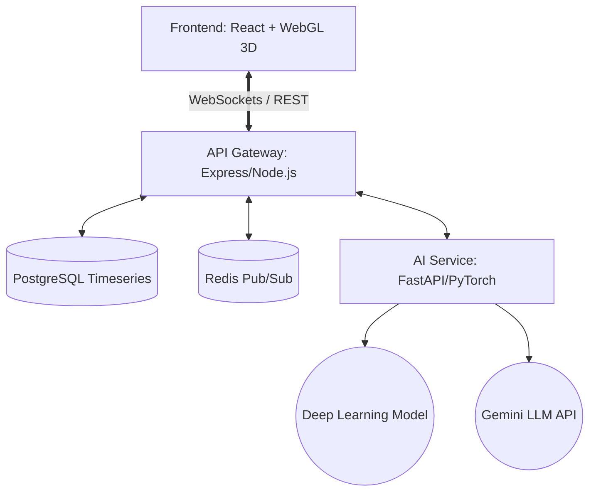

# 🏭 SmartFactory-Nexus (IIoT Digital Twin Platform)


An Enterprise-Grade **Industrial IoT (IIoT) Platform** engineered by **Siva Ganesh**. 
Featuring a WebGL 3D Digital Twin, Real-Time WebSockets Telemetry, Time-Series Analytics, and a PyTorch Deep Learning backend for Predictive Maintenance.

---

## 🌟 Core Enterprise Features (Phases 1-12)

*   **🌐 3D Digital Twin (WebGL):** Real-time 3D visualization of the factory floor using `Three.js` and `React Three Fiber`. Machines physically react and glow (Green/Red) based on live IoT health status. Includes raycasting interactivity for dynamic data fetching on mesh click.
*   **⚡ Real-Time Data Streaming (Redis Pub/Sub):** Bi-directional WebSockets (`Socket.io`) backed by a Redis Message Broker, streaming live machine telemetry directly to the dashboard, eliminating REST polling.
*   **📈 Time-Series Historical Analytics:** Automated ingestion pipeline from Redis to PostgreSQL `telemetry_history` tables. Visualized on the frontend via interactive `Recharts` glassmorphism modals.
*   **🧠 Deep Learning Predictive Maintenance:** A `PyTorch` Feed-Forward Neural Network trained to predict machine failure probabilities based on live sensor data.
*   **🏭 Full-Stack Microservices:**
    *   **Frontend:** React, Vite, Tailwind CSS, Recharts, Three.js
    *   **API Gateway:** Node.js, Express, TypeScript, JWT Auth
    *   **AI Engine:** Python, FastAPI, PyTorch, Google Gemini
    *   **Database:** PostgreSQL (Primary Data) & Redis (Caching/Broker)
*   **🛡️ Role-Based Access Control (RBAC):** Strict JWT middleware separating `Admin` and `Operator` privileges. Operators have read-only views, while Admins can remotely start/stop machines.
*   **🌍 Enterprise Localization (i18n):** Native support for Japanese (日本語) and English UI localization, optimized for global manufacturing environments.
*   **🤖 LLM Factory Assistant:** Integrated Natural Language Processing chatbot capable of analyzing factory output and providing strategic insights.
*   **🚀 Enterprise DevOps:** Fully containerized architecture with multi-stage `Docker` builds, orchestrated via `docker-compose`, and automated CI/CD pipelines via `GitHub Actions`.

---

## 🏗️ Architecture Topology



---

## 🛠️ Technology Stack

| Domain | Technologies |
| :--- | :--- |
| **Frontend UI** | React 18, Vite, TypeScript, Tailwind CSS, Lucide Icons, i18next |
| **3D Graphics** | Three.js, React Three Fiber, React Three Drei |
| **Backend API** | Node.js 20, Express, Socket.io, JSON Web Tokens |
| **AI / ML Backend** | Python 3.11, FastAPI, PyTorch, Scikit-learn, Google GenAI |
| **Databases** | PostgreSQL 15, Redis 7 |
| **DevOps / CI/CD** | Docker, Docker Compose, Nginx, GitHub Actions |

---

## 🚀 Getting Started (Local Development)

### Prerequisites
*   Node.js (v20+)
*   Python (3.10+)
*   PostgreSQL & Redis
*   Docker & Docker Compose (Optional for containerized run)

### 1. Database Setup
Ensure PostgreSQL is running locally on port `5432` and Redis on `6379`.
```bash
# Seed the initial tables
psql -U admin -d smartfactory -f database/init.sql
# Run the API Gateway migrations for Time-Series & Roles
node api-gateway/migrate.js
node api-gateway/seed_operator.js
```

### 2. Run API Gateway
```bash
cd api-gateway
npm install
npm run dev
```

### 3. Run AI Service
```bash
cd ai-service
pip install -r requirements.txt
uvicorn main:app --host 0.0.0.0 --port 8000
```

### 4. Run Frontend
```bash
cd frontend
npm install
npm run dev
```

Visit `http://localhost:5173` and log in with:
*   **Admin Access:** `admin` / `hashedpassword` (Full Control)
*   **Operator Access:** `operator` / `hashedpassword` (Read-Only)

---

## 🐳 Docker Deployment (Production)

To deploy the entire orchestrated microservices stack (Frontend, API Gateway, AI Service, Postgres, and Redis):

```bash
docker-compose -f docker-compose.prod.yml up --build -d
```

---

## 👨‍💻 Credits & Author

**Siva Ganesh**  
*Lead Full-Stack IIoT Engineer*  
Engineered from the ground up to demonstrate advanced proficiency in Microservices Architecture, Real-Time WebGL Graphics, Time-Series Data Engineering, and Applied Deep Learning for Japanese Enterprise Manufacturing.

## 🛡️ License

This project is licensed under the MIT License - see the [LICENSE](LICENSE) file for details.
