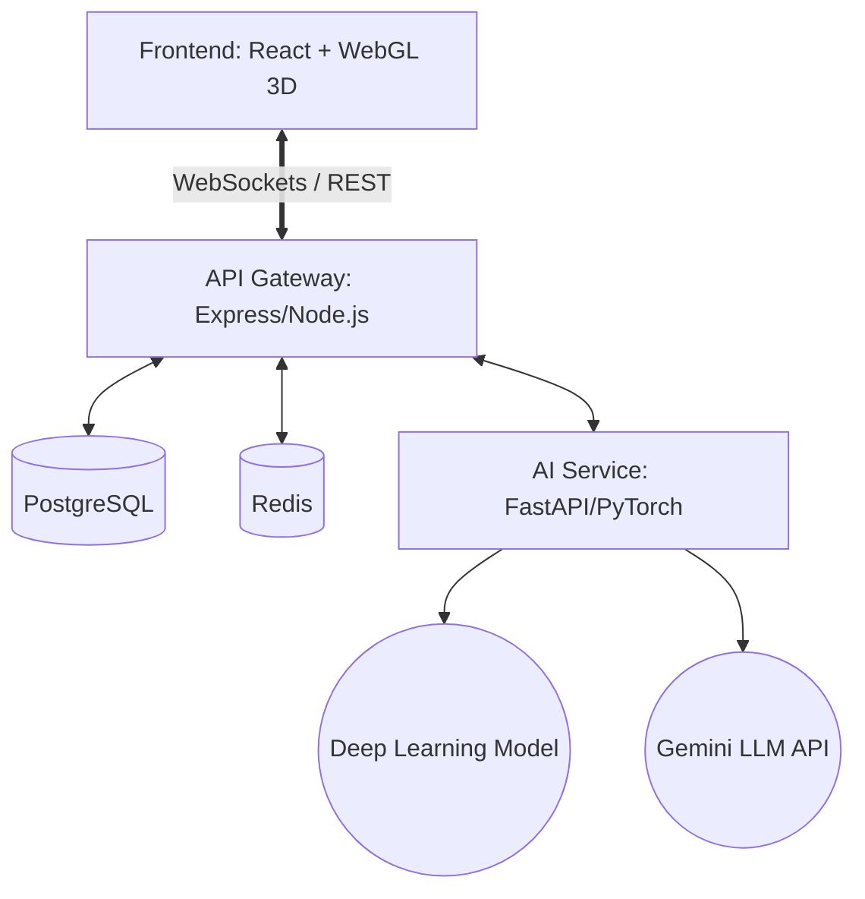

# 🏭 SmartFactory-Nexus (IIoT Digital Twin Platform)


An Enterprise-Grade **Industrial IoT (IIoT) Platform** featuring a WebGL 3D Digital Twin, Real-Time WebSockets Telemetry, and a PyTorch Deep Learning backend for Predictive Maintenance.

---

## 🌟 Core Features

*   **🌐 3D Digital Twin (WebGL):** Real-time 3D visualization of the factory floor using `Three.js` and `React Three Fiber`. Machines physically react and glow (Green/Red) based on live IoT health status.
*   **⚡ Real-Time Data Streaming:** Bi-directional WebSockets (`Socket.io`) streaming live machine telemetry (temperature, vibration, running hours) directly to the dashboard, eliminating REST polling.
*   **🧠 Deep Learning Predictive Maintenance:** A `PyTorch` Feed-Forward Neural Network trained to predict machine failure probabilities based on live sensor data. Includes an MLOps dashboard visualizing real-time training loss and accuracy metrics.
*   **🏭 Full-Stack Microservices:**
    *   **Frontend:** React, Vite, Tailwind CSS, Recharts, Three.js
    *   **API Gateway:** Node.js, Express, TypeScript, JWT Auth
    *   **AI Engine:** Python, FastAPI, PyTorch, Google Gemini
    *   **Database:** PostgreSQL (Primary Data) & Redis (Caching/Broker)
*   **🤖 LLM Factory Assistant:** Integrated Natural Language Processing chatbot capable of analyzing factory output and providing strategic insights.
*   **🚀 Enterprise DevOps:** Fully containerized architecture with multi-stage `Docker` builds, orchestrated via `docker-compose`, and automated CI/CD pipelines via `GitHub Actions`.

---

## 🏗️ Architecture Topology



---

## 🛠️ Technology Stack

| Domain | Technologies |
| :--- | :--- |
| **Frontend UI** | React 18, Vite, TypeScript, Tailwind CSS, Lucide Icons |
| **3D Graphics** | Three.js, React Three Fiber, React Three Drei |
| **Backend API** | Node.js 20, Express, Socket.io, JSON Web Tokens |
| **AI / ML Backend** | Python 3.11, FastAPI, PyTorch, Scikit-learn, Google GenAI |
| **Databases** | PostgreSQL 15, Redis 7 |
| **DevOps / CI/CD** | Docker, Docker Compose, Nginx, GitHub Actions |

---

## 🚀 Getting Started (Local Development)

### Prerequisites
*   Node.js (v20+)
*   Python (3.10+)
*   PostgreSQL
*   Docker & Docker Compose (Optional for containerized run)

### 1. Database Setup
Ensure PostgreSQL is running locally on port `5432` with credentials: `user` / `password`.
```bash
# The database schema is located in:
database/init.sql
```

### 2. Run API Gateway
```bash
cd api-gateway
npm install
npm run dev
```

### 3. Run AI Service
```bash
cd ai-service
pip install -r requirements.txt
uvicorn main:app --host 0.0.0.0 --port 8000
```
*(Note: To enable the LLM Chatbot, add `GEMINI_API_KEY=your_key` to an `.env` file in the `ai-service` directory).*

### 4. Run Frontend
```bash
cd frontend
npm install
npm run dev
```

Visit `http://localhost:5173` and log in with the default seeded admin account:
*   **Username:** `admin`
*   **Password:** `hashedpassword`

---

## 🐳 Docker Deployment (Production)

To deploy the entire orchestrated microservices stack (Frontend, API Gateway, AI Service, Postgres, and Redis):

```bash
docker-compose -f docker-compose.prod.yml up --build -d
```

---

## 🛡️ License

This project is licensed under the MIT License - see the [LICENSE](LICENSE) file for details.
